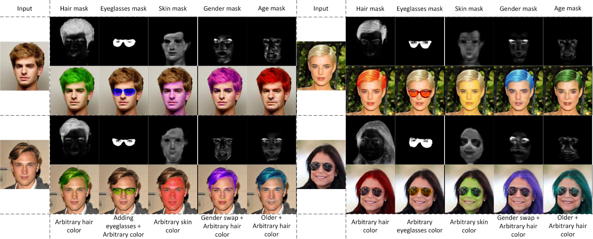
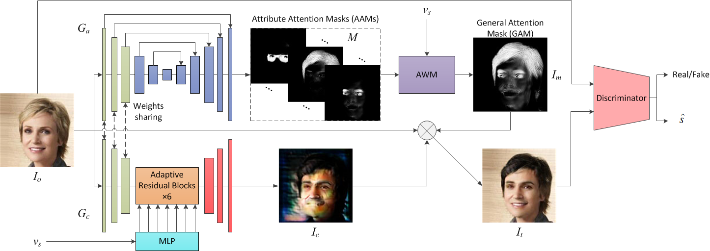
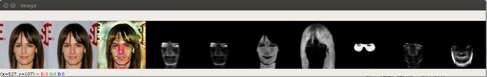
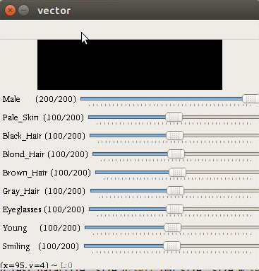
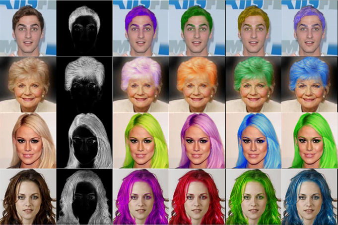
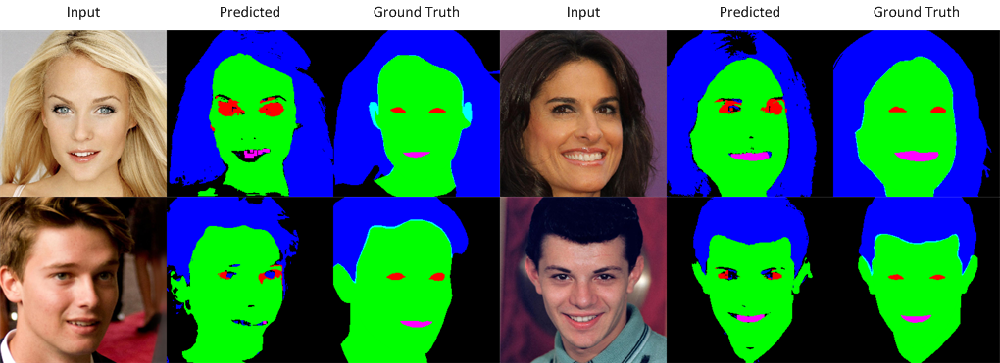

# Self-Attention-Masking Semantic Decomposition and Segmentation for Facial Attribute Manipulation
 We propose a self-attention-masking semantic decomposition method which is able to learn an attribute attention mask for each attribute. User can adjust the strength and color of each attribute smoothly and more freely. Thanks to the attribute attention masks, our method allow manipulate facial attribute without generator after only once generation. Moreover, we can realize facial semantic segmentation without pixel level semantic labels.

Paper URL is [here](https://ieeexplore.ieee.org/document/9000600)

## Requirements

- [Windows or Linux]
- [Tensorflow ( 1.12.0)](https://www.tensorflow.org/)
- [OpenCV](https://docs.opencv.org/3.0-beta/doc/py_tutorials/py_tutorials.html)

## Framework

Our generator G consists of these two parts. A color mask and attribute attention masks are generated by a color mask generator Gc and an attention mask Ga generator respectively. Attribute attention masks are fused into a general attention mask (GAM) for all attributes by an attention weighting module (AWM). Hence our method can manipulate the color and strength of single attribute more freely.

## Dataset Preparation

    ├── main.py
    ├── model
        ├── checkpoint
    ├── CelebA
       ├── celeba
           ├── 000001.jpg 
           ├── 000002.jpg
           └── ...
       ├── list_attr_celeba.txt (For attribute information) 
    ├── test_img
        ├── a.jpg (The test image that you wanted)
        ├── b.png
        └── ...

## Train

	python main.py --phase train

## Test

	python main.py --phase test

- There will be some trackbar for attribute vactor contrl. The vaule of trackbar [0, 200] means the vaule of attribute vactor [-1, 1].

## Pretrained model

- Download checkpoint for [128x128](https://pan.baidu.com/s/19hRGMwCKvbIxfO5DQrt6jQ) (zxjr)

## More results

- Results of hair color manipulation without generator.

- Some semantic segmentation results of hair, skin, eyes, and mouth (256×256 size).

## Related works

- [StarGAN(CVPR 2018)](https://github.com/taki0112/StarGAN-Tensorflow)
- [GANimation(ECCV 2018)](https://github.com/albertpumarola/GANimation)
- [STGAN(CVPR 2019)](https://github.com/csmliu/STGAN)
- [SemanticComponent(CVPR 2019)](https://github.com/yingcong/SemanticComponent)

## Author

Xuan. Xia# SAMSD
